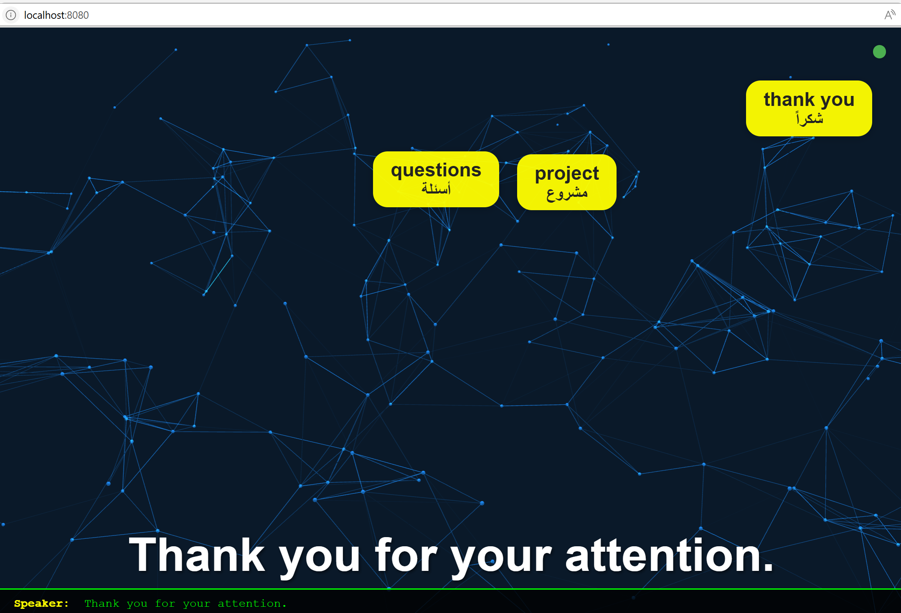
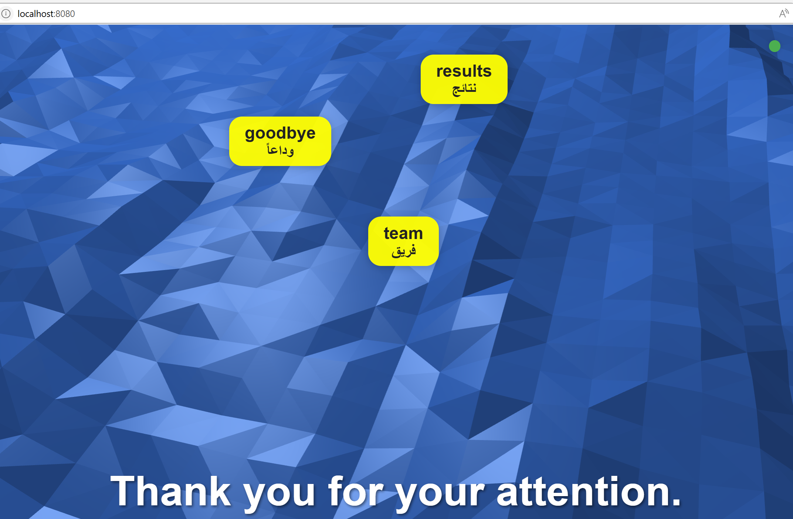
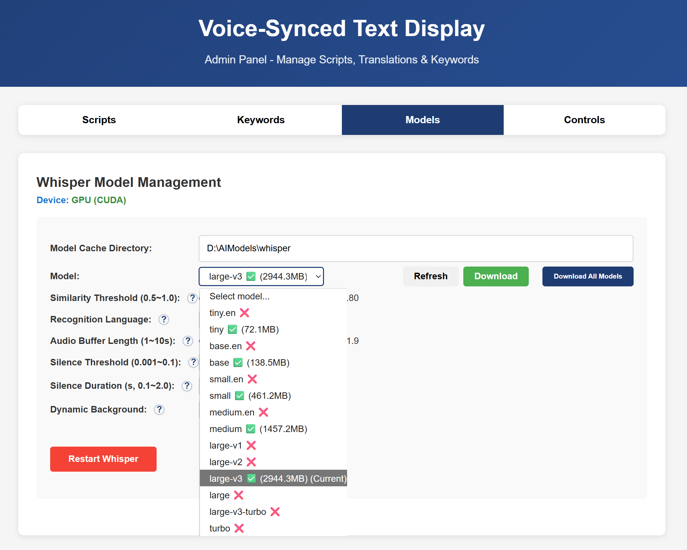

<!-- demo -->
<p align="center">
  
  
  
</p>

# Voice-Synced Text Display

This project is a real-time speech recognition and subtitle/keyword popup display system based on Whisper, suitable for scenarios such as presentations, meetings, and teaching.

- Supports real-time speech-to-text with automatic script line synchronization
- Detects keywords and highlights them as bubble popups, with smart avoidance for multiple keywords
- Provides multiple similarity algorithms for highly synchronized subtitles and speech
- Management panel allows flexible configuration of scripts, keywords, models, and more

---

## Install Python (pytorch only works with python 3.9)
---

## Quick Start (Step-by-Step Installation for CUDA/CPU)

> **Why step-by-step?**
> Python's package ecosystem does not allow pip to cleanly resolve CUDA vs CPU versions of torch when installing openai-whisper and its dependencies. To ensure you always get the correct (CUDA or CPU) version of torch, and avoid dependency conflicts, follow this step-by-step installation process.

### 1. Clone and Enter Project
```bash
git clone <repo-url>
cd voice-synced-display
```

### 2. (See above for Python/venv setup)

### 3. Install torch (choose one)
- **For NVIDIA GPU (CUDA 12.8, e.g. RTX 3060):**
  ```bash
  pip uninstall torch
  pip cache purge
  pip install torch torchvision torchaudio --index-url https://download.pytorch.org/whl/cu128
  ```
- **For CPU only:**
  ```bash
  pip install torch torchvision torchaudio
  ```

### 4. Install openai-whisper (without dependencies)
```bash
pip install openai-whisper==20250625 --no-deps
```

### 5. Install all other dependencies (without torch/whisper)
> **Make sure your requirements.txt does NOT include torch, torchvision, torchaudio, or openai-whisper.**

```bash
pip install -r requirements.txt --no-deps
```

### 6. Verify torch Installation
```bash
python -c "import torch; print(torch.__version__, torch.cuda.is_available(), torch.version.cuda)"
# Should print: 2.2.2+cu121 True 12.1 (for GPU) or 2.2.2+cpu False None (for CPU)
```

### 7. Download Whisper Model
- Web Admin Panel: Start the app, open http://localhost:8080/admin, go to "Models" tab, and download the desired model.
- Or command line: 
   ```bash
   python download_whisper_models.py --model base
   python download_whisper_models.py --model small --cache-dir E:/AIModels
   `

## Whisper Model Direct Download Links (Hugging Face)

If automatic model download fails, you can manually download the model files, place them in your cache directory and rename them seperately(see model list in admin panel). Here are the direct Hugging Face links for each model:

- tiny:      https://huggingface.co/openai/whisper-tiny/resolve/main/model.pt
- tiny.en:   https://huggingface.co/openai/whisper-tiny.en/resolve/main/model.pt
- base:      https://huggingface.co/openai/whisper-base/resolve/main/model.pt
- base.en:   https://huggingface.co/openai/whisper-base.en/resolve/main/model.pt
- small:     https://huggingface.co/openai/whisper-small/resolve/main/model.pt
- small.en:  https://huggingface.co/openai/whisper-small.en/resolve/main/model.pt
- medium:    https://huggingface.co/openai/whisper-medium/resolve/main/model.pt
- medium.en: https://huggingface.co/openai/whisper-medium.en/resolve/main/model.pt
- large-v1:  https://huggingface.co/openai/whisper-large-v1/resolve/main/model.pt
- large-v2:  https://huggingface.co/openai/whisper-large-v2/resolve/main/model.pt
- large-v3:  https://huggingface.co/openai/whisper-large-v3/resolve/main/model.pt

After downloading, rename the file to match the model name (e.g., `small.pt`) and place it in your model cache directory.

## Recommended Startup

**Use the official uvicorn command line to start the service. Do not use run.py:**

```bash
python -m uvicorn app:app --host 0.0.0.0 --port 8080
```
Or (Windows virtual environment)
```bash
.venv\Scripts\uvicorn.exe app:app --host 0.0.0.0 --port 8080
```

- After starting, visit:
  - Main Display: http://localhost:8080
  - Admin Panel: http://localhost:8080/admin
  - API Docs: http://localhost:8080/docs

---

## Basic Workflow

1. **Prepare Scripts**: In the Admin Panel, upload or edit two text files:
   - `script_en.txt`: Source language, one sentence per line
   - `script_translated.txt`: Target language, one sentence per line (same line count/order)
   - Optionally, upload `keywords.csv` for keyword highlighting (`keyword,translation` per line)
2. **Configure Parameters**: In the Admin Panel, set the Whisper model, cache directory, and adjust parameters as needed.
3. **Start Listening**: In the Admin Panel or Main Display, click "Start" to begin speech recognition. Speak clearly, at a moderate pace.
4. **Subtitle Display**: Open http://localhost:8080 in fullscreen for the audience. Subtitles update in real time.
5. **Controls**: Spacebar (start/stop), R (reset line), mouse (on-screen buttons)

---

## File Structure
```
voice-synced-display/
├── app.py                 # Main FastAPI app
├── download_whisper_models.py # Model download utility
├── requirements.txt       # Python dependencies (no torch/whisper)
├── templates/
│   ├── display.html       # Main display page
│   └── admin.html         # Admin panel
└── data/
    ├── script_en.txt      # Example source script
    ├── script_translated.txt # Example translation
    └── keywords.csv       # Example keywords
```

---

## Tips
- For best recognition, speak clearly and at a moderate speed.
- Ensure the number of lines in both script files matches.
- Use a good quality microphone and minimize background noise.
- For offline use, download the required Whisper model in advance.

---

## FAQ
If you encounter issues with WebSocket not starting on Windows, try fully recreating your virtual environment:
```bash
deactivate
rmdir /s /q .venv
python -m venv .venv
.venv\Scripts\pip install "uvicorn[standard]" fastapi
```

**Happy Presenting!**